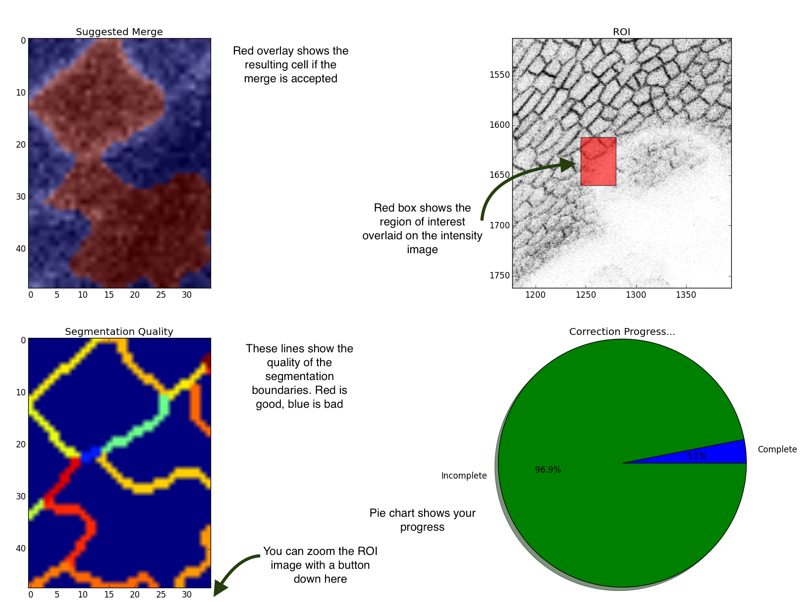

# README
`./lib/segcor2.py` generate the files `merges_(time).txt` which can be applied to the uncorrected image with `./lib/apply_corrections.py` to generate a corrected segmented image.

----

## SegCor2
Located at: `./lib/segcor2.py`

Usage: `segcor2.py [segmented_image_for_correction] [base_image_for_comparison]`

Loads a segmented image and the image for comparison and algorithmically computes the segmentation quality. Ranks segmented cell boundaries in order of poorness. Displays a window which shows (starting from top left):

1. The intensity image with the two merge candidates overlaid in red.
2. The intensity image with the region of interest (ROI) highlighted.
3. The boundaries image showing the calculated boundary quality. (Blue, low quality. Red, high quality).
4. A progress pie chart.

To accept the suggested merge (Window 1), press y. This will merge the two cells, write a new segmented image to the asme directory and record the merge. To refuse the suggested merge, press n. The program will move to the next merge candidate without making changes

#### Commands
| Key                | Command                | Notes                |
| ------------------ | ---------------------- | ---------------------|
| y                  | Accept suggested merge |                      |
| n                  | Reject suggested merge |                      |

----
## Apply Corrections
Located at: `./lib/apply_corrections.py` 

Usage: `python apply_corrections.py [image_to_be_corrected] [corrections_file]`

----

## SegCor (legacy, not recommended)
Located at: `./lib/segcor.py`

Usage: `segcor.py [segmented_image_for_correction] [base_image_for_comparison]`

#### Commands

| Key                | Command                | Notes                                       |
| ------------------ | ---------------------- | ------------------------------------------- |
| up / scroll up     | Zoom In                |                                             |
| down / scroll down | Zoom Out               |                                             |
| left               | Previous Image         |                                             |
| right              | Next Image             |                                             |
| h                  | Move Left              |                                             |
| j                  | Move Up                |                                             |
| k                  | Move Down              |                                             |
| l                  | Move Right             |                                             |
| 1                  | Select Cell 1          | Cell under mouse pointer                    |
| 2                  | Select Cell 2 and merge| Cell under mouse pointer                    |
| b                  | Set cell to background | Change cell under mouse pointer to black    |
| s                  | Save an RGB image      | RGB values denotes cell ID                  |

----

